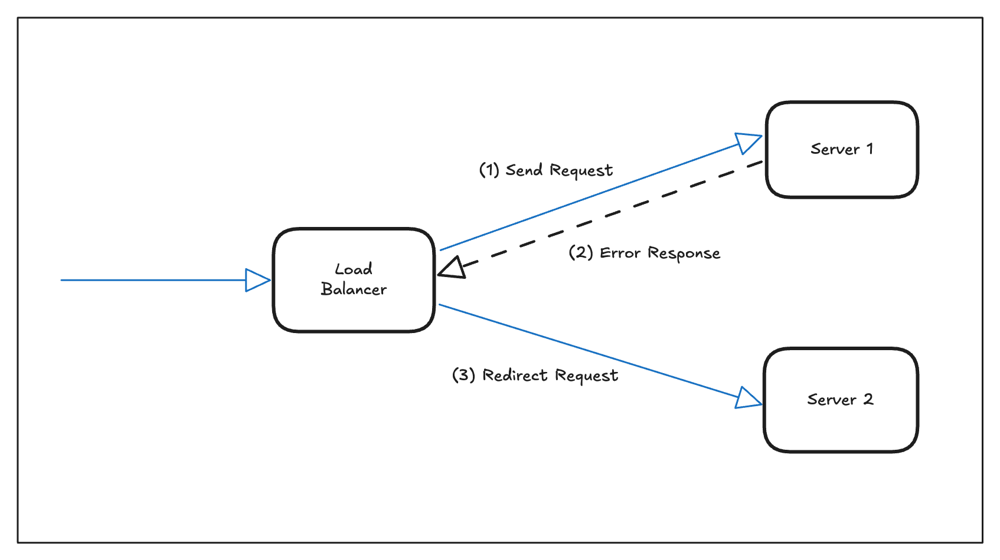
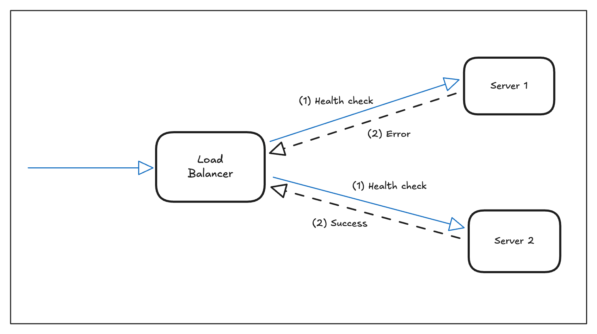
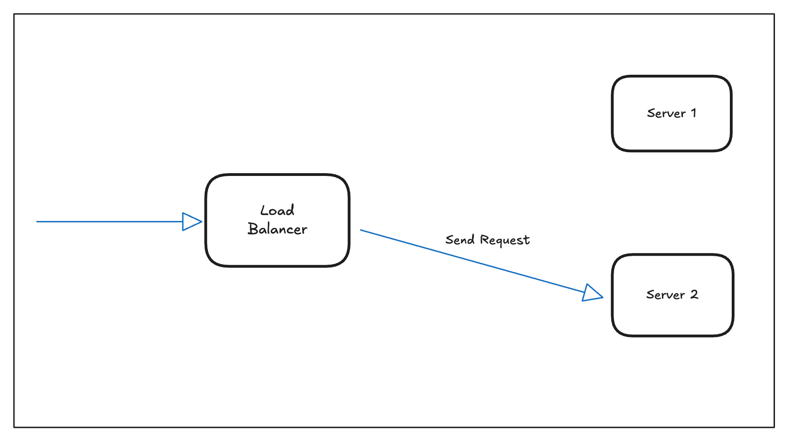

# Hot deployments in Ballerina

Hot deployment enables zero-downtime updates by running multiple Ballerina instances behind an NGINX load balancer. This approach allows you to update applications without service interruption by maintaining at least one healthy instance at all times.

## Overview

Here the hot deployment strategy works by orchestrating multiple service instances through a load balancer, allowing you to update and restart services without interrupting user traffic. The load balancer automatically routes requests away from instances undergoing updates and back to them once they are healthy again.

## Deployment strategies

Choose the right strategy based on your requirements and available tools.

### 1. Active-Active without health checks

All instances actively serve traffic simultaneously. NGINX uses passive health monitoring through `max_fails` and `fail_timeout` directives. When an instance fails to respond successfully `max_fails` times within the `fail_timeout` window, NGINX temporarily removes it from the load balancing pool.

This passive approach relies on actual client requests to detect server failures, meaning the load balancer only discovers problems when real traffic encounters them. Passive monitoring is reactive and depends on the natural flow of requests to identify unhealthy servers. The default load balancing method is `round-robin`, distributing requests evenly across all available servers, though this can be changed to other algorithms like `least connections` or `IP hash` based on application requirements.

Failed requests are automatically retried on other available instances, as a fault tolerance mechanism.



**NGINX configuration**:

```nginx
events {}

http {
    upstream backend {
        server 127.0.0.1:8080 max_fails=3 fail_timeout=30s;
        server 127.0.0.1:8081 max_fails=3 fail_timeout=30s;
    }

    server {
        listen 80;
        location / {
            proxy_pass http://backend;
        }
    }
}
```

### 2. Active-Active with health checks

This configuration requires NGINX Plus, which supports active health checks. NGINX proactively polls a specified health endpoint (e.g., /health) on each instance to determine availability.



Unlike passive health checks that only detect failures when client requests fail, active health checks continuously monitor server health in the background, providing faster failure detection and more reliable service availability. This proactive approach allows NGINX to remove unhealthy servers from the pool before they impact user requests, significantly reducing the mean time to detection and improving overall system reliability.



**NGINX configuration**:

```nginx
events {}

http {
    upstream backend {
        server 127.0.0.1:8080 max_fails=3 fail_timeout=30s;
        server 127.0.0.1:8081 max_fails=3 fail_timeout=30s;
    }

    server {
        listen 80;
        location / {
            proxy_pass http://backend;
            health_check uri=/health interval=5s;
        }
    }
}
```

### 3. Active-Passive configuration

Primary server handles all traffic, backup only activates on failure. The backup server remains idle until the primary fails, ensuring you always have a failover target.


When the primary server fails to send a response, the load balancer immediately redirects the request to backup server. This failover process is automatic and transparent to the client, occurring within milliseconds of detecting the failure. The backup server must be pre-configured with identical application code and dependencies.

Nginx tracks failed requests against `max_fails` threshold and after reaching threshold, server is marked as unavailable for `fail_timeout` duration. And then keep sending request to one of the backup servers. Once a server is marked as unavailable, Nginx will not attempt to send requests to it until the `fail_timeout` period expires, ensuring that the backup server handles all incoming traffic consistently. If multiple backup servers are configured, Nginx will select the first available backup server in the order they are defined, maintaining the single-active-server principle of active-passive architecture.

After `fail_timeout` period, Nginx attempts to route traffic back to primary server. If successful, primary server resumes active role and backup servers return to standby mode. This recovery process is gradual and intelligent - Nginx sends a small number of test requests to the recovered primary server before fully transitioning traffic back. If the primary server successfully handles these test requests without errors, it regains its active status and the backup server automatically transitions back to standby mode. However, if the primary server continues to fail during the recovery attempt, it remains marked as unavailable for another fail_timeout period, and the backup server continues to handle all traffic until the next recovery cycle.

**NGINX configuration**:

```nginx
events {}

http {
    upstream backend {
        server 127.0.0.1:8080 max_fails=3 fail_timeout=30s;
        server 127.0.0.1:8081 max_fails=3 fail_timeout=30s backup;
    }

    server {
        listen 80;
        location / {
            proxy_pass http://backend;
        }
    }
}
```

## Setup guide

To test this locally you can run several Ballerina services parallely and set the relevant uri in the NGINX configurations.

```ballerina
import ballerina/http;

configurable int port = 8080;

service / on new http:Listener(port) {
    resource function get .() returns json {
        return {"message": "Request received", "port": port};
    }
    
    resource function get health() returns json {
        return {"status": "running", "port": port};
    }
}
```

After configuring one of the failover setups (Active-Active or Active-Passive), you can proceed with hot deployment.
First, stop one of the running servers you need to update. If NGINX is configured with health checks, it will automatically detect that the instance is unavailable and stop routing traffic to it. Otherwise, NGINX will attempt to retry the request and redirect it to another available server if the original one fails.
You can then update or redeploy the stopped service with the necessary changes. Once the update is complete, restart the server. When the service is back online and passes the health check, NGINX will resume routing requests to it. You can then repeat the same process for the remaining servers, applying the new changes one by one without causing any downtime.

Key NGINX parameters and best practices for reliable hot deployments,

- **max_fails=3**: Mark server down after 3 failures
- **fail_timeout=30s**: Keep server down for 30 seconds
- **backup**: Only use when primary fails
- **health_check**: Requires NGINX Plus for active monitoring
- Always test configuration: `nginx -t`
